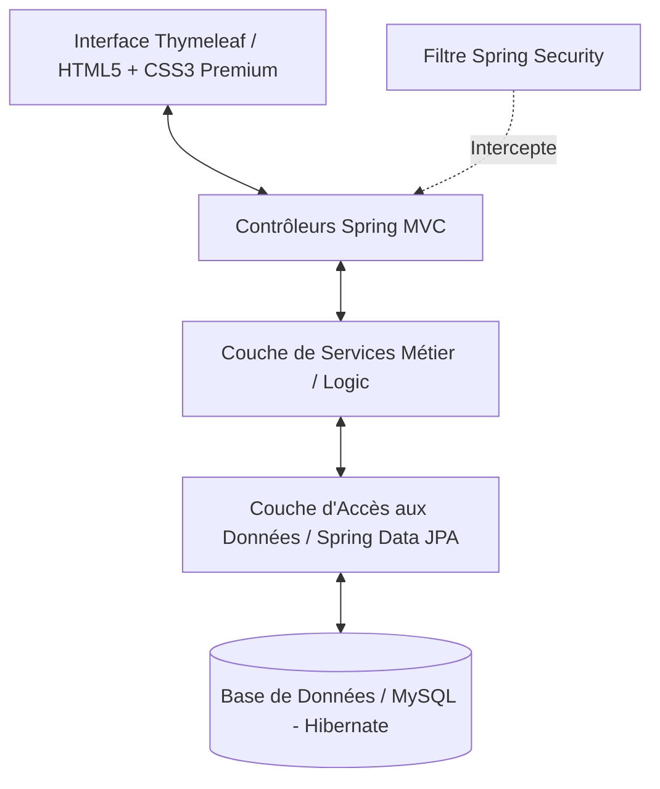
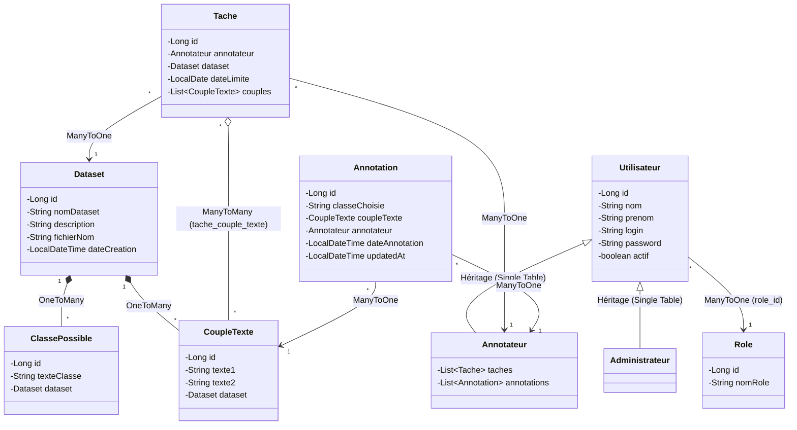
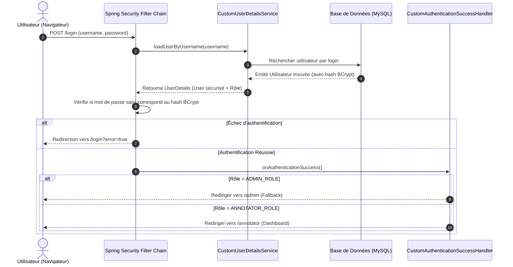
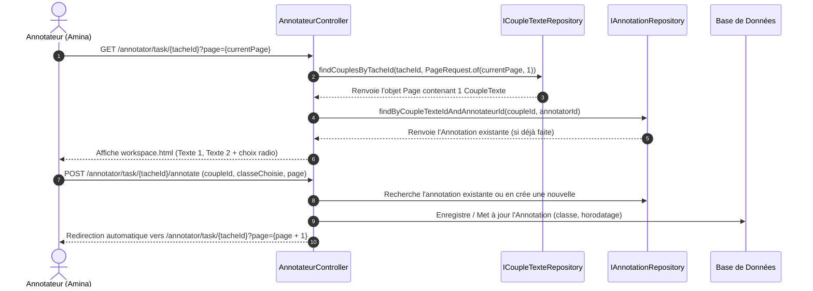

# Documentation Technique & Spécification Détaillée (Lot 1)

Ce document décrit en détail l'architecture, le flux de données complet (end-to-end flow) ainsi que la spécification détaillée des **Modèles**, **Services** et **Contrôleurs** implémentés pour le **Lot 1 (Noyau Sécuritaire & Parcours de l'Annotateur)** du projet de Plateforme d'Annotation NLP Collaborative.

---

## 🗺️ 1. Aperçu de l'Architecture Technique

L'application s'appuie sur une architecture multi-couches Spring Boot standard, garantissant une séparation stricte des responsabilités (SOC - Separation of Concerns) :

> [!TIP]
> **Aperçu Visuel de l'Architecture :**
> 

<details>
<summary>💻 Voir le Code Source Mermaid d'origine</summary>



</details>

1. **Couche Présentation (Thymeleaf / CSS Premium)** : Rend l'interface utilisateur de façon dynamique, gère les interactions et communique avec la couche contrôleur en envoyant des requêtes HTTP (GET/POST).
2. **Couche Sécurité (Spring Security)** : Intercepte les requêtes en amont, gère la session utilisateur, crypte les mots de passe et sécurise les accès selon les rôles.
3. **Couche Contrôleur (Spring MVC)** : Traite les requêtes, prépare les données via les services métier, et sélectionne la vue Thymeleaf appropriée à retourner.
4. **Couche Services (Business Logic)** : Contient l'intelligence métier, l'importation de fichiers CSV/JSON et l'exportation des résultats d'annotations.
5. **Couche DAO / Repository (Spring Data JPA)** : Abstraie les requêtes SQL complexes sous forme de méthodes de requêtes Java ou d'instructions JPQL.
6. **Couche Modèle (JPA Entities)** : Représente la structure physique des tables de la base de données.

---

## 🗃️ 2. Structure Détaillée des Modèles (JPA Entities)

Le package `com.ensah.Core.model` contient l'ensemble des entités persistantes. Les classes ont été restructurées pour s'aligner sur la spécification UML de votre tableau blanc.

> [!TIP]
> **Aperçu Visuel du Schéma UML :**
> 

<details>
<summary>💻 Voir le Code Source Mermaid d'origine</summary>



</details>

### `Utilisateur.java` (Classe Abstraite)
* **Description** : Entité de base représentant un utilisateur générique du système. Utilise la stratégie d'héritage `InheritanceType.SINGLE_TABLE` avec une colonne de discrimination `dtype`.
* **Attributs clés** :
  - `Long id` : Clé primaire auto-générée (`IDENTITY`).
  - `String nom` & `String prenom` : Identité de la personne.
  - `String login` (Unique) : Identifiant unique de connexion.
  - `String password` : Stocke le mot de passe crypté via l'algorithme `BCrypt`.
  - `boolean actif` : Permet d'activer ou de suspendre un compte (utile pour Spring Security).
  - `Role role` : Relation **ManyToOne** mappée par la colonne physique `role_id` (chaque utilisateur possède un rôle unique).

### `Administrateur.java` (Étend `Utilisateur`)
* **Description** : Sous-classe discriminée par `@DiscriminatorValue("Administrateur")`. Ne possède pas de champs supplémentaires propres, mais permet de distinguer les privilèges d'administration.

### `Annotateur.java` (Étend `Utilisateur`)
* **Description** : Sous-classe discriminée par `@DiscriminatorValue("Annotateur")`.
* **Relations clés** :
  - `List<Tache> taches` : Relation **OneToMany** représentant toutes les tâches assignées à cet annotateur.
  - `List<Annotation> annotations` : Relation **OneToMany** représentant toutes les annotations qu'il a déjà validées.

### `Role.java`
* **Description** : Structure des profils d'accès (`ADMIN_ROLE`, `ANNOTATOR_ROLE`).
* **Attributs** :
  - `Long id`
  - `String nomRole`

### `Dataset.java`
* **Description** : Ensemble homogène contenant des données NLP à analyser.
* **Attributs et Relations** :
  - `Long id`, `String nomDataset`, `String description`, `String fichierNom`.
  - `List<ClassePossible> classesPossibles` : Liste des catégories d'annotation (OneToMany, orphelin supprimé en cascade).
  - `List<CoupleTexte> couples` : Liste des paires textuelles associées (OneToMany, orphelin supprimé en cascade).

### `ClassePossible.java`
* **Description** : Étiquette ou catégorie possible d'annotation (ex. *neutral*, *contradiction*, *positive*).
* **Attributs** :
  - `Long id`, `String texteClasse`.
  - `Dataset dataset` (ManyToOne) : Dataset auquel appartient cette catégorie.

### `CoupleTexte.java` (Restructuré selon Tableau Blanc)
* **Description** : Paire de textes à analyser.
* **Attributs clés** :
  - `Long id`
  - `String texte1` & `String texte2` : Les deux phrases ou paragraphes à évaluer (Longueur max de 2000 caractères, obligatoire).
  - `Dataset dataset` (ManyToOne) : Le dataset conteneur.
  - `List<Annotation> annotations` (OneToMany) : Historique des annotations posées sur ce couple.
  - `List<Tache> taches` (ManyToMany) : Les tâches dans lesquelles ce couple de textes a été inclus.

### `Tache.java`
* **Description** : Tâche d'annotation attribuée à un annotateur.
* **Attributs et Relations** :
  - `Long id`, `LocalDate dateLimite`.
  - `Annotateur annotateur` (ManyToOne) : L'annotateur responsable.
  - `Dataset dataset` (ManyToOne) : Le dataset cible.
  - `List<CoupleTexte> couples` (ManyToMany) : Sous-ensemble de couples de textes affectés à cette tâche spécifique via la table `tache_couple_texte`.
* **Méthode d'aide** : `ajouterCouple(CoupleTexte couple)` pour lier dynamiquement les couples à la tâche lors de l'affectation.

### `Annotation.java`
* **Description** : Verdict ou décision d'annotation d'une paire de textes par un annotateur.
* **Attributs clés** :
  - `Long id`
  - `String classeChoisie` : Valeur sélectionnée par l'annotateur.
  - `CoupleTexte coupleTexte` (ManyToOne) : Le couple évalué.
  - `Annotateur annotateur` (ManyToOne) : L'auteur de l'annotation.
  - `LocalDateTime dateAnnotation` : Date de création automatique (`@PrePersist`).
  - `LocalDateTime updatedAt` : Date de dernière modification automatique (`@PreUpdate`).

---

## 🔒 3. Le Noyau Sécuritaire (Spring Security Flow)

Le flux de sécurité intercepte toutes les requêtes utilisateur et assure que seuls les utilisateurs authentifiés accèdent à leurs espaces dédiés.

### A. Flux d'Authentification complet :

> [!TIP]
> **Aperçu Visuel du Flux d'Authentification :**
> 

<details>
<summary>💻 Voir le Code Source Mermaid d'origine</summary>



</details>

### B. Configuration de Sécurité (`AppSecurityConfig.java`)
Cette classe configure la sécurité applicative en déclarant :
* Le bean `BCryptPasswordEncoder` pour la validation et le cryptage des mots de passe.
* La chaîne de filtres (`SecurityFilterChain`) avec les règles suivantes :
  - Accès libre aux fichiers statiques (`/css/**`, `/js/**`, `/images/**`).
  - Les routes `/admin/**` requièrent le rôle `ADMIN_ROLE`.
  - Les routes `/annotator/**` requièrent le rôle `ANNOTATOR_ROLE`.
  - Le formulaire de login personnalisé est défini sur `/login`. En cas de succès, la main est passée à `CustomAuthenticationSuccessHandler`.
  - La déconnexion (`/logout`) invalide la session HTTP et redirige vers `/login?logout`.

---

## 💻 4. Le Moteur de Production & d'Annotation (Workspace Flow)

L'Espace d'Annotation (Workspace) repose sur une gestion par **Pagination** Spring Data JPA. Cela permet d'obtenir un couple de textes unique par page, offrant une interface épurée sans saturer la mémoire du serveur.

### A. Cycle de vie d'une Annotation (Flow) :

> [!TIP]
> **Aperçu Visuel du Cycle de Vie d'une Annotation :**
> 

<details>
<summary>💻 Voir le Code Source Mermaid d'origine</summary>



</details>

### B. Spécification Détaillée des Contrôleurs

#### `AnnotateurController.java`
Gère l'intégralité du cycle de travail de l'annotateur connecté.

* **`GET /annotator` (Tableau de Bord)** :
  - **Objectif** : Affiche la liste des tâches avec indicateurs dynamiques.
  - **Flux** :
    1. Récupère l'utilisateur connecté depuis la session de sécurité (`SecurityContextHolder`).
    2. Récupère sa liste de tâches via `IAnnotateurRepository`.
    3. Calcule pour chaque tâche le pourcentage de progression :
       $$\text{Progression (\%)} = \left( \frac{\text{Nombre de couples annotés par l'utilisateur}}{\text{Nombre total de couples dans la tâche}} \right) \times 100$$
    4. Permet un filtrage optionnel par statut via le paramètre `filter` (`all`, `todo`, `done`).
    5. Transmet les indicateurs globaux (Tâches en cours, total annoté) et redirige vers `annotator/dashboard.html`.

* **`GET /annotator/task/{tacheId}` (Espace d'Annotation / Workspace)** :
  - **Objectif** : Affiche une paire textuelle unique à évaluer.
  - **Flux** :
    1. Récupère l'index de page (par défaut `0`).
    2. Effectue une requête paginée via `ICoupleTexteRepository.findCouplesByTacheId(tacheId, PageRequest.of(page, 1))`.
    3. Si la page demandée est supérieure ou égale au nombre total d'éléments, cela signifie que la tâche est complétée. Le contrôleur affiche alors le template de réussite.
    4. Récupère le couple de textes. Si l'utilisateur l'a déjà annoté par le passé, charge l'annotation existante depuis `IAnnotationRepository` afin de pré-cocher sa sélection dans l'interface.
    5. Récupère la liste des `ClassePossible` associées à ce dataset pour dessiner les boutons de vote.
    6. Renvoie vers le template premium `annotator/workspace.html`.

* **`POST /annotator/task/{tacheId}/annotate` (Enregistrement d'Annotation)** :
  - **Objectif** : Enregistre le choix de classification dans la base de données.
  - **Flux** :
    1. Récupère l'annotateur connecté et le couple de textes concerné.
    2. Recherche si une annotation existe déjà pour ce couple de textes et cet annotateur.
    3. Si elle existe, met à jour le champ `classeChoisie`. Sinon, instancie une nouvelle entité `Annotation` avec la classe choisie et l'associe à l'annotateur et au couple de textes.
    4. Sauvegarde l'entité en base via `IAnnotationRepository.save()`.
    5. Redirige l'utilisateur vers la page suivante de la même tâche (`page + 1`) pour une expérience fluide d'enchaînement de tâches.

* **`GET /annotator/stats` (Statistiques Personnelles)** :
  - **Objectif** : Affiche les métriques de productivité personnelle de l'annotateur.
  - **Flux** :
    1. Compte le nombre total de tâches assignées et de couples de textes.
    2. Compte le nombre total d'annotations rédigées par cet annotateur.
    3. Exécute la requête JPQL groupée `IAnnotationRepository.countAnnotationsByClassForAnnotateur` pour obtenir la liste de répartition (ex: *Neutral : 25*, *Entails : 50*, *Contradiction : 15*).
    4. Récupère les 10 dernières annotations triées par date décroissante pour afficher un tableau historique.
    5. Transmet le modèle à la vue `annotator/stats.html`.

#### `LoginController.java`
* **`GET /login`** :
  - Traite l'accès à l'interface de connexion.
  - Intercepte les paramètres de statut de Spring Security (`?error` pour une erreur d'identifiants, `?logout` après une déconnexion réussie) et les injecte dans le template Thymeleaf `login.html`.

---

## 💾 5. Les Méthodes et Requêtes JPQL Personnalisées (Couche DAO)

La couche d'accès aux données utilise des requêtes JPA personnalisées pour optimiser les performances de calcul :

### `ICoupleTexteRepository.java`
```java
@Query("SELECT ct FROM CoupleTexte ct JOIN ct.taches t WHERE t.id = :tacheId ORDER BY ct.id ASC")
Page<CoupleTexte> findCouplesByTacheId(@Param("tacheId") Long tacheId, Pageable pageable);
```
* **Utilité** : Effectue une jointure interne entre la table de jointure des tâches et les couples de textes, puis trie les couples par ID ascendant et retourne un objet paginé selon les critères du `Pageable`.

### `IAnnotationRepository.java`
```java
@Query("SELECT a.classeChoisie, COUNT(a) FROM Annotation a WHERE a.annotateur.id = :annotateurId GROUP BY a.classeChoisie")
List<Object[]> countAnnotationsByClassForAnnotateur(@Param("annotateurId") Long annotateurId);
```
* **Utilité** : Aggrège et compte toutes les annotations d'un utilisateur par classe choisie. Retourne une liste de couples de données `[NomClasse, TotalAnnotations]` pour construire les graphiques de répartition de l'onglet Statistiques.

---

## 📥 6. Services d'Import/Export & Parseur de Fichiers (CSV/JSON)

### A. Parseur Multi-Format (`CsvHelperImpl.java`)
Ce service implémente `ICsvHelper` et prend en charge l'importation de jeux de données volumineux :
* **Détection du format** : Analyse le Content-Type du fichier. S'il contient `json`, il appelle le moteur de parsing JSON, sinon il lit le fichier en tant que CSV.
* **Parsing CSV** : Utilise un `BufferedReader` pour lire ligne par ligne, découpe la chaîne au niveau de la virgule (en ignorant les sauts de ligne), puis attribue la première colonne à `texte1` et la seconde à `texte2`.
* **Parsing JSON Robuste (Rétrocompatible & Tableau Blanc)** :
  - Analyse l'arbre JSON avec Jackson `ObjectMapper`.
  - Pour chaque nœud du tableau, il gère de manière robuste les variables selon les deux architectures : il vérifie la présence de `texte1`/`texte2` (le format français officiel de votre tableau blanc), et s'il est absent, il récupère `text1`/`text2`.
  ```java
  ct.setTexte1(node.has("texte1") ? node.get("texte1").asText() : (node.has("text1") ? node.get("text1").asText() : ""));
  ```

### B. Exportateur des Annotations (`ExportServiceImpl.java`)
Ce service implémente `IExportService` et permet de télécharger les résultats d'annotations au format CSV propre :
* **Flux** :
  1. Récupère tous les couples associés au dataset spécifié.
  2. Instancie un `ByteArrayOutputStream` et écrit un en-tête CSV conforme à votre tableau blanc : `id,texte1,texte2,classe,annotateur,date_annotation`.
  3. Pour chaque couple, il récupère l'ensemble des annotations associées.
  4. S'il n'y a pas encore d'annotation, il exporte la ligne avec des colonnes vides à la fin.
  5. S'il y a des annotations, il génère une ligne par annotation en échappant les guillemets et les retours à la ligne via une méthode d'aide `escape()` pour éviter de corrompre le fichier CSV final.

---

## 🌱 7. L'Amorçage Automatique des Données (`DataInitializer.java`)

Pour garantir que l'application soit immédiatement opérationnelle et testable dès le premier lancement en local, ce composant s'exécute au démarrage (`CommandLineRunner`) et effectue les opérations suivantes :
1. **Création des Rôles** : Insère les entités `ADMIN_ROLE` et `ANNOTATOR_ROLE` si elles n'existent pas en base de données.
2. **Administrateur d'Installation** :
   - Crée le compte administrateur requis (login `admin` / mot de passe crypté `admin`).
3. **Comptes Annotateurs de Test** :
   - Crée le compte de test d'Amina (login `amina` / mot de passe crypté `amina`).
   - Crée le compte de test de Youssra (login `youssra` / mot de passe crypté `youssra`).
4. **Jeu de données NLP** :
   - Crée un dataset complet de test appelé `"Similarité Textuelle NLI"`.
   - Insère les catégories valides : `entails` (implication), `neutral` (neutre), `contradiction`.
   - Insère 5 exemples de paires textuelles d'inférence (ex. *Un homme joue au football sous la pluie battante* comparé à *Un homme fait du sport en plein air*).
   - Crée et assigne des tâches contenant ces 5 exemples aux deux annotateurs de test, avec des dates limites différentes, ce qui remplit instantanément leur tableau de bord.
